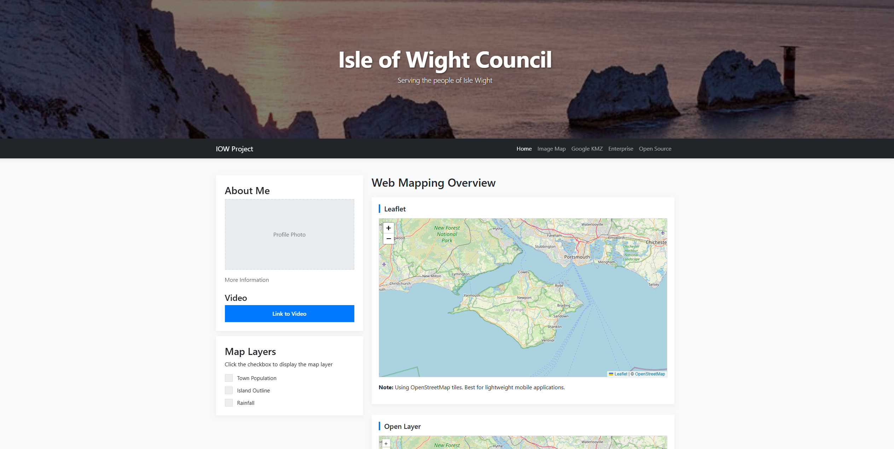

Mapping Libraries and APIs
Google Maps API
Purposefully included with API restrictions on the Google API Platform.
Official Documentation: [Google Maps API](https://www.example.com)

Leaflet
Lightweight open-source JavaScript library for interactive maps.
Documentation: [Leaflet Reference](https://leafletjs.com/examples/geojson/)

ArcGIS JavaScript SDK
Comprehensive SDK for building GIS web applications.
Documentation: [ArcGIS JS SDK](https://developers.arcgis.com/javascript/latest/)

OpenLayers
High-performance open-source library for displaying map data in web browsers.
Documentation: [OpenLayers](https://openlayers.org/)

Preview

